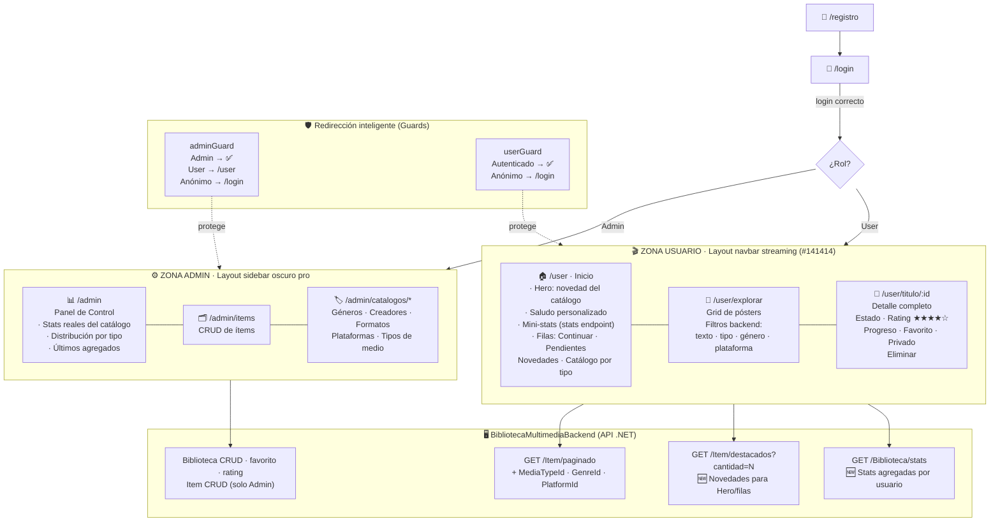

# 📋 CAMBIOS — Separación Usuario/Admin e Interfaz tipo Netflix

> **Fecha:** 22 de agosto de 2026
> **Proyectos:** `biblioteca-multimedia-frontend` (Angular 21) y `BibliotecaMultimedia` (.NET API)

---

## 🎯 Objetivo

Separar completamente la experiencia de **usuario final** de la de **administración**, dándole al usuario una interfaz visual estilo *streaming* (Netflix/Spotify): hero banner, carruseles de pósters y fichas de detalle. Además se renovó el panel admin con estética "dashboard oscuro pro" con métricas reales.

---

## 🗺️ Diagrama de la nueva arquitectura



---

## 🖥️ Backend (`~/Programacion/BibliotecaMultimedia`)

### 1. Filtros avanzados en `Item/paginado`
- **`Application/DTOs/Peticion/Paginacion/Filtros/FiltroItem.cs`**
  Nuevas propiedades opcionales: `MediaTypeId`, `GenreId`, `PlatformId` (`Guid?`).
- **`Application/Service/ItemService.cs`** → `ObtenerItemsPaginado`
  Los filtros se combinan dinámicamente con el patrón `Expression.And()` ya existente en `ExpressionExtensions`. El filtro por género usa `i.ItemGenres.Any(g => g.GenreId == id)` (traducido a SQL por EF Core). Compatibilidad total: si no se envían, el endpoint funciona igual que antes.

### 2. Endpoint nuevo: `GET /api/v1/Item/destacados?cantidad=12`
- **`ItemController.cs`**: `[HttpGet("destacados")]`, `[AllowAnonymous]`.
- **`IItemService.cs` / `ItemService.cs`**: `ObtenerDestacados(cantidad)` — devuelve los últimos ítems creados (`CreatedAt DESC`), orden determinista con desempate por `Id`, cantidad validada entre 1 y 50. Alimenta el **hero banner** y la fila **"Novedades"**.
- Ruta declarada antes de `{id:guid}` para evitar colisiones.

### 3. Endpoint nuevo: `GET /api/v1/Biblioteca/stats`
- **DTO nuevo** `RespuestaBibliotecaStatsDto.cs`: `TotalItems`, `Pendientes`, `EnProgreso`, `Completados`, `Abandonados`, `Favoritos`, `RatingPromedio`.
- **`IBibliotecaService.cs` / `BibliotecaService.cs`**: `ObtenerStats(userId)` — una sola consulta sobre `UserItems` filtrada por ownership del usuario autenticado (mismo criterio de seguridad que el resto del controlador).
- **`BibliotecaController.cs`**: `[HttpGet("stats")]` hereda `[Authorize]` de la clase.

✅ Verificado: `dotnet build` compila sin errores ni advertencias.

---

## 🎨 Frontend (`biblioteca-multimedia-frontend`)

### 1. Separación real de zonas
| Zona | Antes | Ahora |
|---|---|---|
| `/admin` | Sidebar compartida | Sidebar propia **dark pro** (fondo `#0B1120`, acentos neón cyan) |
| `/user` | Misma sidebar de consola | **Navbar superior fija estilo streaming** (`user-layout`) |

- **`shared/components/user-layout/`** *(nuevo)*: navbar transparente con degradado que se vuelve sólida `#141414` al hacer scroll (`HostListener`), logo STREAMBOX rojo, links Inicio/Explorar, saludo con nombre, avatar con inicial + logout, menú móvil. Ambos roles pueden navegarla; los admins ven un acceso extra al panel.
- **`layout.ts`** (admin): ahora fuerza tema oscuro al entrar (`themeService.setDarkMode(true)`) para que PrimeNG (tablas, diálogos) sea consistente; HTML restyleado completo a dark pro con enlaces cruzados "Vista Usuario".
- **`theme.service.ts`**: `setDarkMode` pasó de `private` a público.

### 2. Guards con redirección inteligente
- **`admin-guard.ts`**: anónimo → `/login`; usuario normal → `/user`; solo Admin pasa.
- **`user-guard.ts`**: cualquier autenticado pasa (ambos roles); anónimo → `/login`.

### 3. Sistema de tarjetas y carruseles *(nuevo)*
- **`shared/components/user/poster-card/`**: tarjeta póster `aspect-[2/3]` con imagen (o fallback con gradiente + título), badges de estado y favorito, y **hover expandido estilo Netflix**: escala suave, panel inferior deslizante con título, subtítulo, ratings, sinopsis recortada y acciones (ver detalle ➜, agregar ➕, favorito ♥). Emite eventos tipados (`abrir`, `agregar`, `toggleFavorito`) con el modelo `PosterCardItem`.
- **`shared/components/user/content-row/`**: carrusel horizontal con título, flechas ‹ › que aparecen al hover (scroll suave al 85 % del ancho), scrollbar oculta y modo skeleton integrado. Link opcional "Ver todo".
- **`shared/components/user/skeleton-card/`**: placeholder animado `pulse`.

### 4. Inicio tipo Netflix — `features/user/inicio/` *(nuevo, reemplaza al dashboard-tabla)*
- **Hero banner**: novedad del catálogo (primer destacado con imagen), backdrop con dobles gradientes, badge "Novedad", meta (rating/tipo/formato/año/plataforma), botones "Más información" y "+ Mi lista".
- **Saludo personalizado**: `Hola, {nombre}` desde el claim del JWT (`AuthService.nombreUsuario`).
- **Mini-stats**: 4 tarjetas (Pendientes/En progreso/Completados/Favoritos) alimentadas por el nuevo endpoint `stats`.
- **Filas**: *Continuar* (EnProgreso), *Pendientes*, *Novedades* (destacados) y hasta 4 filas del *Catálogo agrupado por tipo de medio*.
- Acciones en fila: agregar rápido y toggle favorito sin salir del inicio; estado vacío con CTA a Explorar.
- Se eliminaron los archivos del antiguo `features/user/dashboard/`.

### 5. Página de Detalle — `features/user/detalle-titulo/` *(nuevo)*
Ruta `/user/titulo/:id`:
- Cabecera backdrop + póster + ficha completa (géneros como chips, creadores, plataforma, ISBN…).
- Panel de gestión **si está en tu biblioteca**: cambio de estado (autoguarda y setea fechas inicio/fin según corresponda), calificación ★★★★★ clickeable (PUT `rating`), edición inline de progreso ("Temp. 2 Cap. 5"), toggles favorito/privado y eliminación con `ConfirmDialog`.
- Si no está: selector de estado inicial + alta directa.

### 6. Explorar rediseñado — `features/user/explorar/`
- Tabla PrimeNG → **grid responsive de pósters** (2–6 columnas) con skeletons.
- **Filtros delegados al backend**: buscador por texto + chips de tipo de medio + selects de género y plataforma (usan los nuevos parámetros `MediaTypeId/GenreId/PlatformId`).
- Botón **"Cargar más"** con paginación real vía header `X-Pagination`.

### 7. Panel Admin renovado — `features/admin/dashboard/`
Stats falsas hardcodeadas → **datos reales**:
- 4 tarjetas con totales reales (ítems, géneros, creadores, tipos de medio) desde los metadatos de paginación, con gradientes neón y links directos a cada sección.
- Gráfica de barras CSS **Distribución por tipo de medio** (calculada client-side).
- Lista **Últimos agregados al catálogo** con mini-pósters (usa `Item/destacados`).

### 8. Servicios y modelos actualizados
- `FiltroGlobal`: `mediaTypeId?`, `genreId?`, `platformId?` → serializados por `buildPaginationParams` como query params PascalCase que espera la API.
- `ItemService.obtenerDestacados(cantidad)` *(nuevo)*.
- `BibliotecaService.obtenerStats()` *(nuevo)*.
- Modelo nuevo `biblioteca-stats.model.ts`.
- `auth.model.ts`: `UserState.nombre` + computed `nombreUsuario` (claim `unique_name`/`name` del JWT).

### 9. Rutas (`app.routes.ts`)
```
/admin            → adminGuard + LayoutComponent (sidebar)
/user             → userGuard + UserLayoutComponent (navbar streaming)
/user/explorar
/user/titulo/:id
```

✅ Verificado: `npm run build` compila sin errores; la suite de tests queda igual o mejor que antes (22 specs preexistentes seguían fallando por falta de providers antes de estos cambios; el spec del dashboard admin fue corregido y ahora pasa).

---

## 🔌 Resumen de contratos nuevos

| Método | Ruta | Auth | Descripción |
|---|---|---|---|
| GET | `/api/v1/Item/paginado?MediaTypeId=&GenreId=&PlatformId=` | Anónimo | Filtros combinables con búsqueda textual existente |
| GET | `/api/v1/Item/destacados?cantidad=12` | Anónimo | Novedades del catálogo (máx. 50) |
| GET | `/api/v1/Biblioteca/stats` | Usuario | Conteos por estado, favoritos y rating promedio propios |

---

## 🚀 Cómo probarlo

1. **Backend**: `dotnet run --project BibliotecaMultimedia.API` (puerto `5150`).
2. **Frontend**: `npm start` y abrir la URL de Angular Dev Server.
3. Entrar con un usuario **estándar** → aterrizas en el Inicio estilo Netflix.
4. Probar: hover en tarjetas, flechas de carrusel, agregar desde fila "Novedades", abrir detalle, cambiar estado/calificar/marcar favorito, explorar con chips de tipo.
5. Entrar con un **admin** → panel dark pro con métricas reales; también puede visitar `/user` desde la sidebar.

## 💡 Ideas futuras (fuera de alcance)
- Preview expandida al estilo Netflix puro (tarjeta grande que tapa vecinos) — requiere medición de viewport y portales.
- Endpoint de imágenes públicas por item para lazy galleries.
- Recomendaciones personalizadas (géneros más consumidos).
